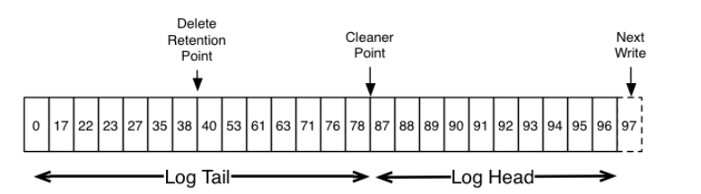
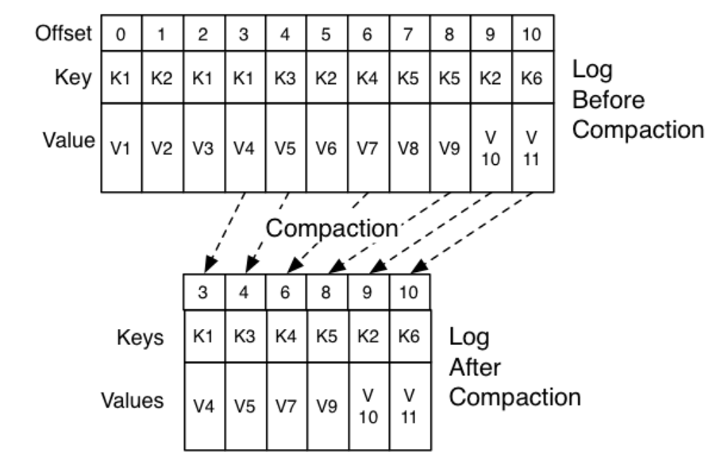

 Kafka 的日志压缩确保了对于每个 topic 的每个 partition 中的日志数据来说，每个消息 key 都会保留至少最后一个已知的 value。这个功能主要是为了解决以下这些场景：应用崩溃或者系统宕机之后的状态恢复、系统维护阶段节点重启之后的缓存加载等等。让我们深入到下面这些案例的细节中来探究一下日志压缩究竟是如何工作的。

迄今为止，我们仅仅描述过数据保留最简单的方式：在经过一段固定时长之后或者当日志量达到了预设值之后，消息就被直接丢弃。这种方式对于那种每个消息之间互相独立的临时性数据是很友好的，然而还有一类很重要的数据流：那些有索引的、可变数据的变更记录日志（比如说一个数据库中的数据变化日志）在这种策略下并不适用。

接下来我们讨论一个这样数据流的具体例子。假如说我们有一个 topic 中存储的是用户的 email 地址，每当有用户更新他们的 email 地址时我们都以这个用户的 id 作为 key 向这个 topic 中发送一个变更消息。下面就是一段时间内一个 id 为 123 的用户所发出的消息，每个消息都表示这个用户 email 地址的一次变更（其他用户的消息先暂时忽略）：

- 123 => bill@microsoft.com
- ...
- 123 => bill@gatesfoundation.org
- ...
- 123 => bill@gmail.com

日志压缩给我们提供了一种更细粒度的日志保留机制，我们可以保证针对每个 key 都保留至少最后一次数据更新（比如说 `bill@gmail.com`）。这样做带来的效果就是我们可以保证的不仅仅是最近变化的 key 的消息，而是所有 key 最终值的一个快照。这意味着即使 broker 没有保留日志的所有变更，下游的 consumer 依然可以恢复它们的状态。

下面看一些日志压缩有用武之地的一些场景，通过这些场景你会了解到日志压缩功能应该如何被使用。

1. _数据库变更订阅。_通常来说，将一个数据库存到多个数据系统中是很有必要的，而且这些系统一般都是多种类型的（要么是 RSBMS，要么或是新型的 key-value 存储系统）。比如说，你可能需要一个数据库、一份缓存、一个搜索集群以及一个 Hadoop 集群。数据库的每个数据变更操作都需要同时反映到缓存、搜索集群以及 Hadoop 集群上。假如这个系统仅仅是处理实时更新数据的话，那么你可能只需要存储最近的变更日志即可；但是如果你希望可以重新加载缓存或者恢复一个搜索集群节点，那么你可能需要一个完整的数据集。
2. _时间追踪处理模式。_这是一种程序设计风格，它将查询处理和程序设计放在一起，并使用变更日志作为程序的主要存储内容。
3. _高可用的日志系统。_一个做本地计算的进程可以通过将它对本地状态作出的修改写到外部系统中来实现容错，因为这样一来一旦它自己宕机了，另外一个进程就可以重新加载这些变更来顶替它的位置。一个具体例子就是在流处理系统中处理计数、聚合计算以及其他类似于"group by"的操作。一个实时流处理框架 Samza 就使用了[这个特性](https://samza.apache.org/learn/documentation/0.7.0/container/state-management.html)来实现高可用。

在上面这些案例中，下游消费服务主要是处理数据变化的实时数据流，但是偶尔当服务宕机或者需要重新加载/重新处理时，下游消费服务就需要做一次全部数据的加载。日志压缩特点使得面对同一个 topic 的数据可以满足以上两种数据流处理模式。这种日志使用模式在[这篇博客](https://engineering.linkedin.com/distributed-systems/log-what-every-software-engineer-should-know-about-real-time-datas-unifying)中描写得更加详细。

一般通用的方案都很简单。如果我们有无限的日志保留措施，那么在上面这些案例中，我们可以记录下每次数据变化，这样一来我们就可以从它一开始的时候就捕捉到系统每个时间段的状态。基于全部的日志我们可以通过回放前 N 条记录来恢复任意时间点的状态。但是这种全日志保留的假设并不现实，尤其是对那些单条记录会更新多次的场景下，在这种场景下，即使针对一个大小稳定的数据集也会产生出无限的日志出来。一种简单的日志保留策略就是追丢弃过时的更新日志，这样做可以使得日志的存储空间不会无限增长，但是带来的坏处就是日志永远没法用来恢复当前的状态了——这种情况下，从日志的开头开始回放永远不会重建出当前的状态因为旧的更新记录没法捕捉到了。

日志压缩机制提供了一种更细粒度的基于记录的保留策略，这和基于时间这种更粗粒度的保留策略不同。这种思想就是有选择地移除那些近期有过更新的 key 的旧记录。利用这种机制进行日志保留保证了对于每个 key 都保留了至少最后一个状态。<br />这种保留策略可以按照 topic 的粒度进行设置，所以一个 kafka 集群可以同时拥有基于时间或者大小保留日志的策略以及以及基于压缩保留日志的策略。

这项功能的灵感来自于 LinkdedIn 最古老也是最成功的的一项基础设施服务——名为 [Databus](https://github.com/linkedin/databus) 的数据库日志更新缓存服务。和大多数的日志结构存储系统不同的是，Kafka 建立之初就是用于订阅功能，同时使用更快速的线性读写方式来存储数据。同时又和 Databus 不同的是，Kafka 更像是一个真实数据源的存储单元，所以即使在上游数据无法重放的情况下，它依然很有用。

## 日志压缩基础知识

下面是一张展示带有 offset 值的 Kafka 日志逻辑结构的比较高级抽象的图片。



日志的头部（Log Head）和传统 Kafka日志是完全一样的。都保留了所有的消息，同时具备紧凑且连续的 offset。日志压缩增加了一个处理日志尾部（Log Tail）的选项。上面的图片就展示了一个被压缩的日志尾部。值得注意的是日志尾部的消息仍然保留了他们第一次被写入到日志中的那个 offset 值，这个offset 值是永远不会变的。还有一点需要注意的是：即使有一些 offset 的消息已经被压缩掉了，大那是日志中的所有 offset 值仍然有效，这些被压缩掉的消息的 offset 和接下来没有被压缩掉的消息的 offset 值标识的是当前日志中的同一个消息。比如说，在上面图片中的 36、37、38 这三个 offset 值所对应的位置都是一样的，从这三个 offset 值开始消费都会立刻消费到 38 这个消息。

压缩也是允许删除的。一个仅有 key 但是没有 value 的消息会被看成是日志中的一个删除标记。这个删除标记意味着在此之前任何带有相同 key 的消息都是可以删除的（就像任何带有这个 key 的新消息一样？），但是删除标记是一种特殊的消息，因为他们本身将在一段时间后从日志中清理出来以释放空间。在上图中，不再保留删除标记的时间点被标记为“删除标记保留点（delete retention point）”。

压缩的过程是通过在后台周期性地复制日志段来实现的。日志清除工作不会阻塞实际的读操作，同时我们可以通过配置一个I/O 吞吐量使得清理所占用的资源不超过这个预设值，这样就可以避免影响到 producer 和 consumer 的实际工作。一个日志段的压缩过程看起来就像是下面这样：



## 日志压缩可以提供哪些保证？

1. 任何追得上日志头部的 consumer 都可以消费到写到 topic 中的每一条消息，这些消息都有连续的序列号。topic 级别的`min.compaction.lag.ms` 配置用于保证一条消息从被写入到压缩之前的最短时间，换句话说，这个配置提供了一个消息保留在日志头部（非压缩范围）的时间下限。
2. 消息的顺序永远是保证的。压缩不会改变消息的顺序，它只会移除消息。
3. 消息的 offset 值永远不会发生变化。offset 是一条消息在日志中位置的永久且唯一的身份标识。
4. 任何从日志最初位置开始消费的 consumer 都至少会看到每个 key 按照写入顺序的最终状态。此外，一旦 consumer 在短于 topic `delete.retention.ms` 这个配置值（默认 24h）的时间内消费到了日志的最头部分，所有待删除的记录对应的删除标记对于它来说都是可见的。换句话说，对于一个 consumer 而言，如果消费延迟大于`delete.retention.ms`配置值，它是有可能会错过删除标记的，因为删除标记和读消息是同时进行的。

## 日志压缩细节

日志压缩是由 log cleaner 完成的，log cleaner 就是一组后台线程，它们不停地来回拷贝日志段文件、移除那些 key 已经在日志头部出现过的记录。每一个log cleaner 线程的具体工作如下：

1. 选择一个日志头记录数量 / 日志尾记录数量 比例最高的一个日志
2. 创建出一个关于在日志头中每个 key 对应的最后一个 offset 的摘要
3. 从头到尾再拷贝一次日志整体，不过这次会移除那些在日志后面出现过的 key 对应的消息。新拷贝的这个日志段文件会被立即替换到日志中，因为拷贝过程中所需的额外磁盘空间也不过就是一个日志段的大小（不是日志的完整副本）
4. 日志头部的摘要本质上就是一个空间紧凑的哈希表。这个哈希表的每个条目都是 24 个字节，因此，使用 8GB 的 log cleaner 缓冲区，一个迭代过程大概可以压缩 366GB 的日志头部空间（假设有 1k 个消息）

## 如何配置日志压缩

log cleaner 默认就是开启状态，也就是说日志清理线程默认就被创建出来了。要在一个特定的主题上启动日志清理，你需要添加如下的日志相关属性：

```
  log.cleanup.policy=compact
```

这个属性既可以在topic 创建过程中指定，也可以在topic 修改过程中指定。

log cleaner 也可以配置日志头部应该至少保留多少记录不被压缩。通过设置下面的压缩时间间隔可以实现这个目的。

```
 log.cleaner.min.compaction.lag.ms
```

这个配置可以用于防止比最小消息存活时间还短的消息被压缩。如果不设置的话，除了最后一个日志段（也就是当前正在写的一段），其余的所有日志段都会被压缩。即使当前 active 的日志段的所有消息的时间都已经滞后了最小压缩时间，这个日志段也仍然不会被压缩。

更多关于 log cleaner 的细节可以看[这里](https://kafka.apache.org/documentation.html#brokerconfigs)。
