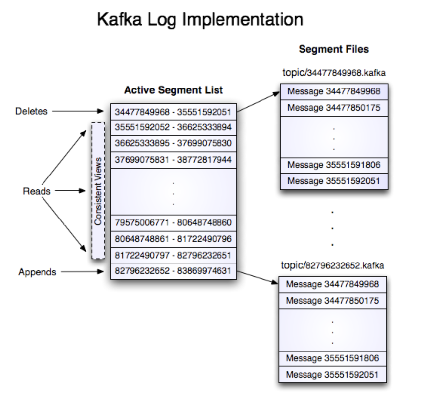

一个具有两个 partition 且名字为 "my topic" 的 topic 由两个文件目录组成（名字分别是 `my_topic_0`和`my_topic_1` ），每个目录都包含了这个 topic 的消息文件。日志文件的格式就是一连串的日志条目（log entry），每个日志条目开头是一个 4 字节的整数 N，代表这个消息的长度，紧接着是 N 个字节的消息体（**NOTE**: 没太理解，日志文件中的消息格式应该是 5.3 中提到的record batch 格式，而不是这里有一个 4 字节的消息长度）。每个消息由一个 64 位的整数 offset 来唯一标识，offset 给出了这个消息在这个 topic/partition 上所有消息中的位置。每条消息在磁盘上的格式下面会描述。每个日志文件是以它内部包含的第一条消息的 offset 值来命名的。所以第一个日志文件的名字就应该是 00000000000.kafka，后面每个额外追加的日志文件也与前一个日志文件有类似的整数名称，且文件大小大约是S 个字节，其中 S 是配置中给定的最大日志文件大小。

每个 Kafka 记录的确切二进制格式是受版本控制的，同时作为一个标准接口维护起来。因此在需要时，Kafka 记录批次无需重新复制或者版本转换就可以在 producer、broker 以及 consumer 之间传输。上一节详细介绍了 Kafka 日志记录的磁盘格式。

使用消息的偏移量作为消息 id 并不是一个通用的行为。我们最初的想法是由 producer 生成一个 GUID，同时在每个 broker 上维护 GUID 到 offset 之间的映射关系。但是又因为 consumer 必须要为每个 broker 维护一个 id，所以这样看来一个全局唯一的 GUID 没有任何价值。此外，维护一个随机 id 到 offset 之间的映射关系非常复杂，它需要一个很重的索引结构，而且这个索引结构需要和磁盘数据同步变化，本质上就是一个完整的持久化随机访问数据结构。因此，为了简化查询的数据结构，我们决定使用一个简单的分区原子计数器，这个计数器可以和 partitionId\nodeId 配合使用来唯一标识一条消息；这种标识方式即使会让每个 consumer 存在多次查询的可能，但是它使得查询结构变得更加简单。当我们确定使用计数器这种标识方式之后，直接使用 offset 作为消息索引就变得十分自然，毕竟这两个结构都是单调递增的整数且在同一个 partition 内都是唯一的。由于 offset 对于 consumer 的 API 是完全不透明的，所以这个决定只是采用更有效方法的一个实现细节。



## 写

日志允许串行追加，并始终追加到最后一个日志文件中。当文件达到了一个可配置的大小之后（比如说 1GB），该文件将会被一个新的文件所替代。日志有两个配置参数：M，给定了在强制操作系统将文件刷新到磁盘之前要写入的信息条数；S，给出了多少秒后会强制刷盘。这样可以保证在系统崩溃时最多丢失 M 条消息或者 S 秒钟的数据。

## 读

读取 kafka 消息时需要提供一个 64 位的逻辑 offset 值以及一个 S 字节的最大缓冲块大小。这将返回 S 个字节的包含消息迭代器的一个缓冲块。S 字节的大小应该大于任意一条消息，但是如果出现了一个异常很大的消息，读操作可能会尝试重试多次，每次都将缓冲块的大小翻倍，直到这条消息被成功读取。使用者可以指定最大消息长度以及以及缓冲块的最大值，消息最大长度可以使得 broker 拒绝掉比这个值更大的消息，缓冲块的最大值可以对客户端为获得完整消息而需要读取的最大值进行约束。读取缓冲块很有可能以消息的一部分内容结束，这很容易通过消息大小的分隔符来检测到。

从一个 offset 值开始读数据的实际过程首先要求能找到存储数据的日志段文件，然后根据全局的 offset 值计算得到针对于这个日志文件的相对 offset 值，最后从这个文件的相对 offset 值开始读取数据。日志文件的搜索是在每个文件的日志范围进行简单的二分查找方式完成的。

日志还提供了获取最近写入消息的能力，允许客户端从“当前时间”开始订阅。这在 consumer 没有在 SLA 规定的时间内完成消费的情况下也是有用的。在这种场景下，当客户端试图消费一个不存在的 offset 值时，broker 会返回一个 `OutOfRangeException`，客户端可以根据当前的使用场景来决定是重置消费 offset 还是直接失败。

下面是发送给 consumer 的结果格式。

```
MessageSetSend(fetch result)

total length	: 4 bytes
error code		: 2 bytes
message 1			: x bytes
...
message n			: x bytes
```

```
MultiMessageSetSend(multiFetch result)

total length	: 4 bytes
error code		: 2 bytes
messageSetSend 1
...
messageSetSend n
```

## 删除

Kafka 每次删除一个日志段。`Log Manager` 支持可插拔地配置删除策略，用于选择哪些文件符合删除条件。当前的策略是删除修改时间超过 N 天的日志文件。不过保留最近 N GB 的删除策略也很好用。为了避免在删除过程中修改日志段集合对读操作进行加锁，我们使用了一种 `copy-on-write` 模式的日志段集合实现方式，它可以在删除过程中提供一个日志段集合的不可变的静态快照视图，读操作可以基于这个一致性视图做二分查找。

## 保证

Kafka 日收支提供了一个配置参数 M 用于控制在强制刷盘之前可以写入的最大消息数量。在服务刚启动时会运行一个日志恢复进程，这个进程会遍历最新的日志段中所有消息并验证每个消息条目是否合法。如果一个消息条目的整体大小以及 offset 小于文件的长度，而且消息的有效负载的 CRC32 与消息中存储的 CRC 字段相匹配，那么认为这条消息是合法的。如果检测到消息有损坏，那么日志将会被截断到最后一个有效的消息的 offset 所在的位置。

需要注意的是，两类消息损坏是一定要处理的。一种是由于服务崩溃出现了一个没有成功写入的数据块导致的截断，一种是向文件中添加了一个无意义数据块的损坏。后者的原因是：通常操作系统并不会保证 `file inode` 和实际数据块的写入顺序，因此除了丢失数据之外，一旦一个 `inode` 的大小被更新，同时恰好在写入包含该数据的块之前服务崩溃了，文件可能就会被写入无意义的数据。CRC 可以检测到这种极端情况，同时防止它损坏日志（当然，未写入的消息还是会丢失了）。

